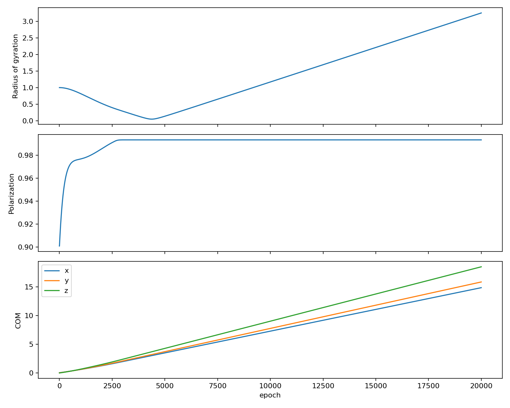
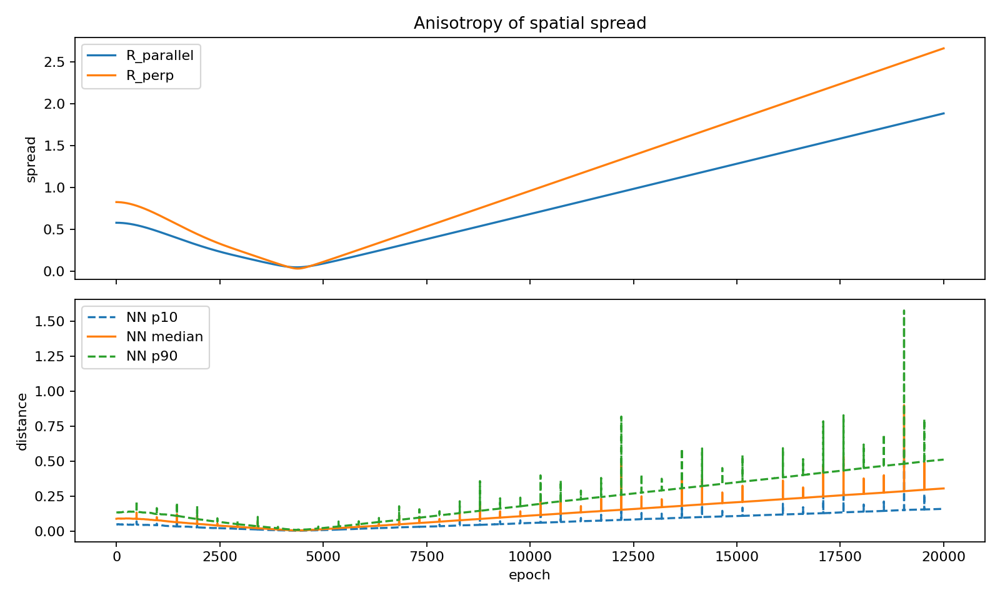

# Advanced Boids Simulation 

This simulation is a complex CUDA C++ simulation that aims to implement a highly efficient representation of a broadband communications network. 

## network/ 

The `network` module implements a simulated broadband network that aims to 

### Data Analysis of Simulation 

Let $\Sigma = \Cov(\textbf{r_i})$ be the $3\times 3$ covariance of positions relative to the center of mass. Let $\hat{u}$ be the unit direction of the average velocity. $R_\parallel$ is the parallel spread and $R_\perp$ is the perpendicular spread. That is how the flock moves parallel and perpendicular to the average motion of the flock.

#### Polarization 

#### Anisotropy 

Parallel and Perpendicular Spread. Parallel spread computed by $R_\parallel = \sqrt{\hat u}^T \Sigma \hat{u}$. The perpendicular spread $R_\perp = \sqrt{\tr(\Sigma) - \hat{u}^T \Sigma \hat u}. Anisotropy index = $\frac{R_\perp - R_\parallel}{R_\perp + R_\parallel}$

#### Radius of Gyration 

Radius of gyration, $R_g^2=\tr(\Sigma) = R^2_\parallel + R^2_\perp$.

#### Nearest Neighbor 
